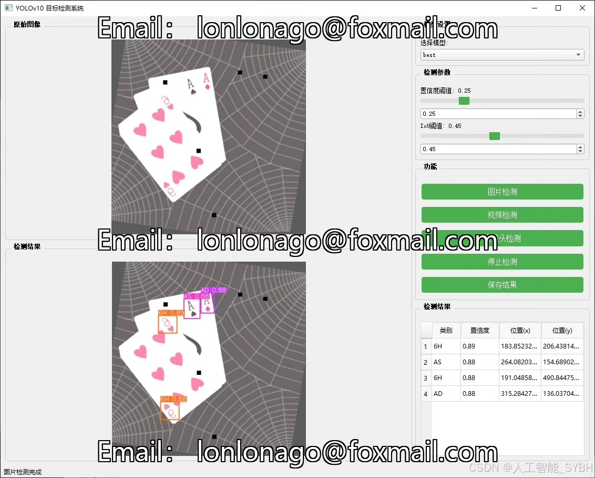
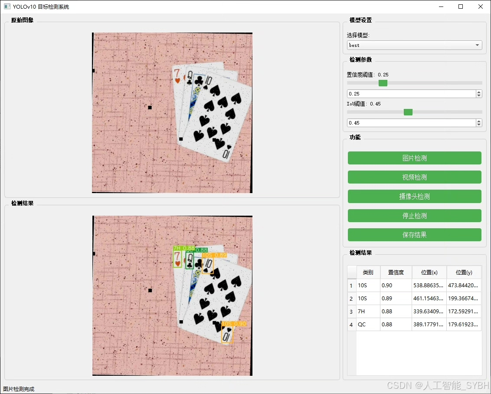
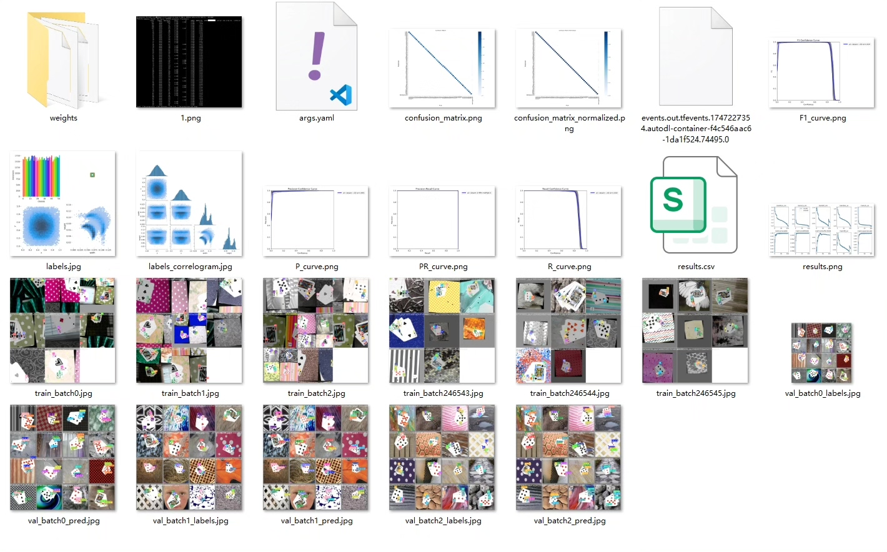
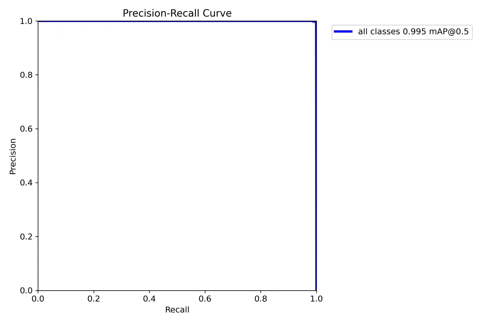
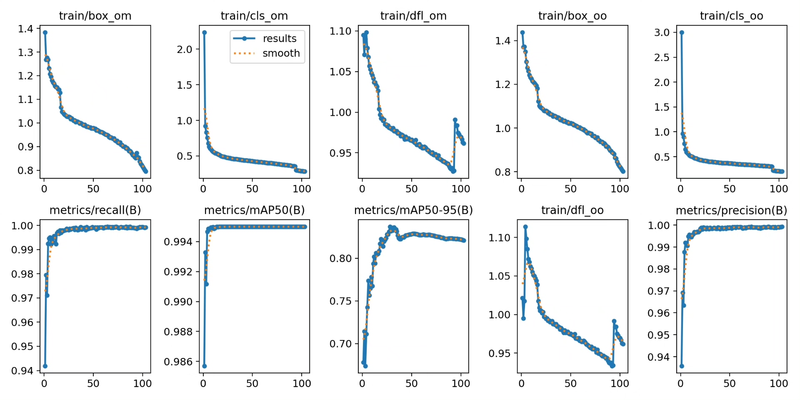
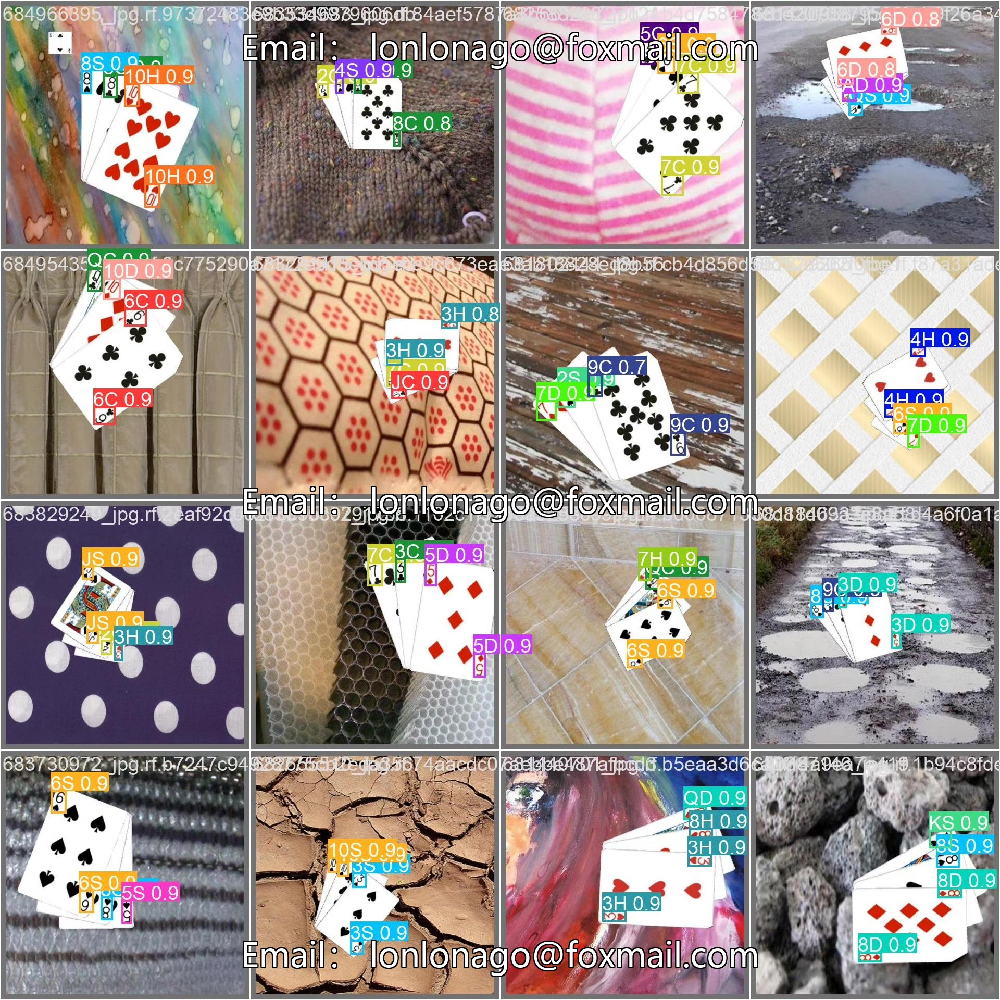
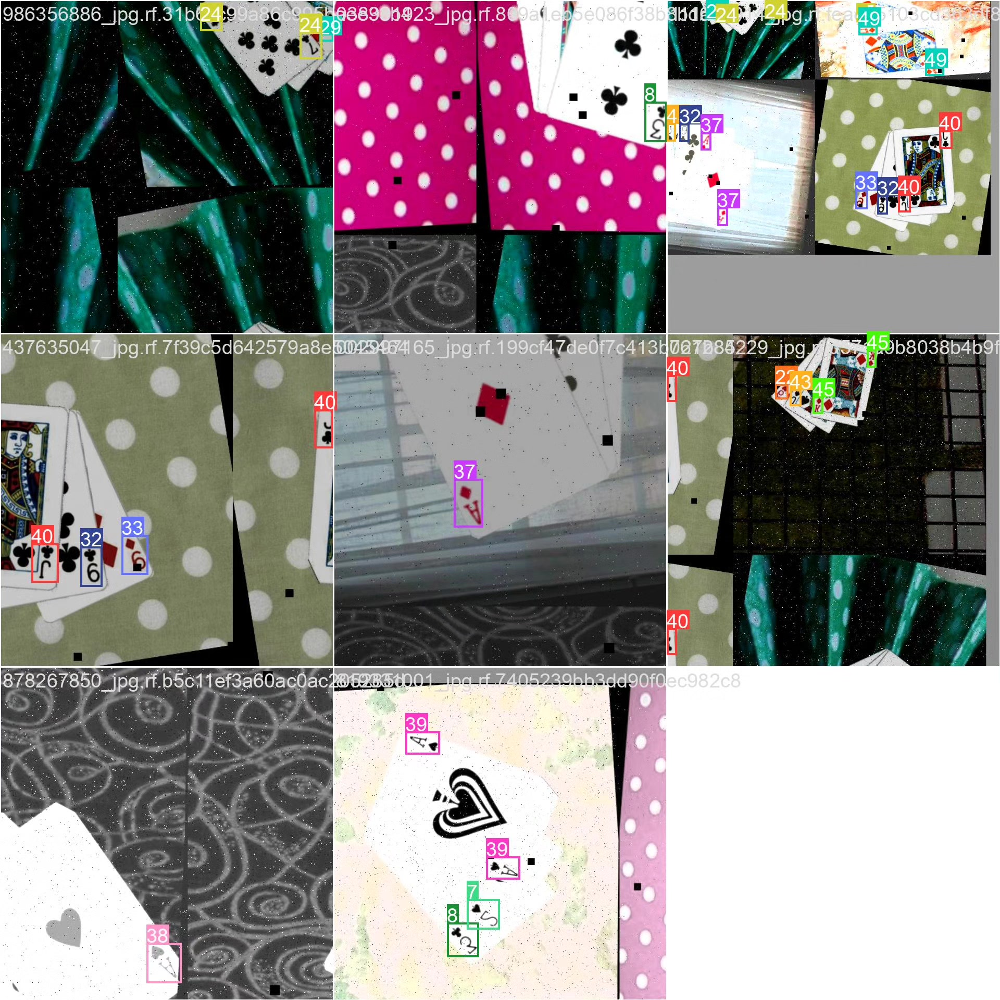

# Based on deep learning YOLOv10 for poker card recognition detection system (YOLOv1)

## Body

This project has developed a high-precision poker card recognition detection system based on the YOLOv10 object detection algorithm. It can accurately recognize and locate 52 standard poker cards (including 13 points × 4 colors). The system was trained and validated on a dataset containing 24,233 images, with 21,203 training images, 2,020 validation images, and 1,010 test images. This system can detect the type, location, and quantity of poker cards in real-time, and is widely applicable in fields such as casino surveillance, automatic scoring in poker games, magician teaching analysis, and intelligent robotic grasping. It holds significant practical value and business prospects.

The company's products have obtained the official commercial license certification from YOLO.

We provide after-sales service.

After payment, we will provide WeChat ID for any questions.

Environment configuration: We will provide an environment configuration tutorial, and WeChat will provide answers to questions.

Remote installation service: If you need remote configuration, an additional fee of 69 is required.
If the configuration fails, all fees will be refunded (only the installation fee is refundable for older computers).

Retraining dataset: After configuring the environment, you can train on your own computer.
If you need us to retrain, just pay 69 + computing power fees (2.5 yuan/hour).

Full after-sales service

## Images

## Payment

Here is a pay link on Stripe ( https://buy.stripe.com/3cs8yP7sY87d0vu9AB ). Please contact me lonlonago@foxmail.com after funding $89, and I will send you a complete data files , thank you!

